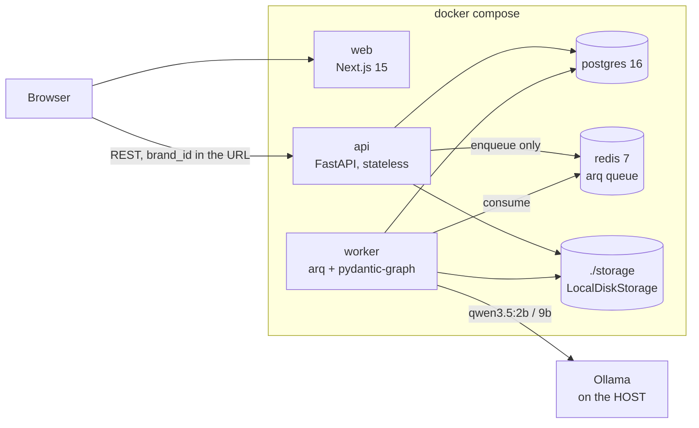
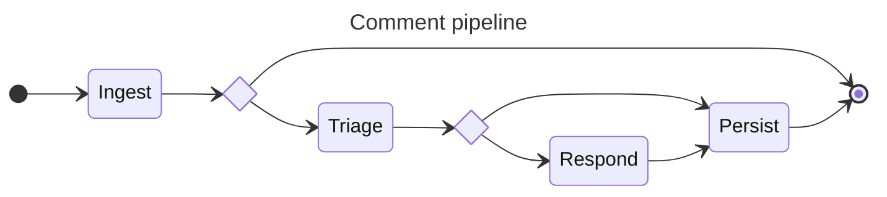
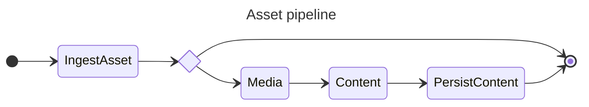
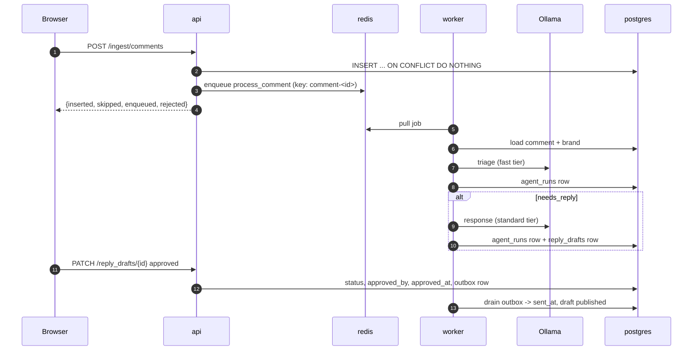
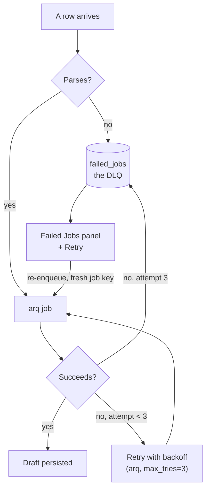
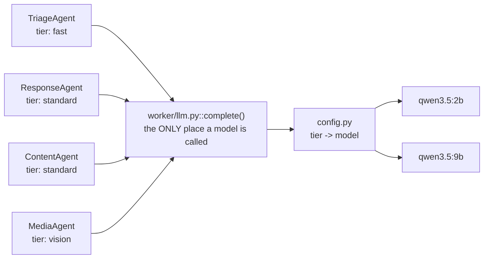

# SocialOps — Phase 1 architecture

What runs, what talks to what, and what happens to one comment and one photo.
Phase 1 is entirely local: Docker Compose, Postgres, Redis, and Ollama on the
host. Every decision behind this is in [DECISIONS.md](DECISIONS.md).

The two pipeline diagrams below are **generated** from the `pydantic-graph`
definitions in `worker/orchestrator.py` by `make diagrams`. That is one of the
three things the graph was adopted for ([D12](DECISIONS.md)) — a hand-drawn
pipeline diagram is wrong the first time someone adds a node, and nobody
notices for a month.

---

## Containers

Five services. The API is stateless ([D2](DECISIONS.md), hard rule #2): nothing
survives a request except in Postgres, Redis, or the storage volume, which is
what makes the Phase 3 move to several API tasks behind a load balancer a
scaling change rather than a rewrite.

Two things worth reading off that picture:

- **The browser talks to the API directly**, not through Next.js. So
  `NEXT_PUBLIC_API_URL` is the address as the *browser* sees it — the compose
  service name `api:8000` does not resolve there.
- **The API never consumes a job.** It writes to the queue; the worker owns
  execution and retries (hard rule #7). There is exactly one retry mechanism in
  the system, and it is arq's.

Ollama runs on the host rather than in Compose because the models need the
host's memory and GPU, and the containers reach it at
`host.docker.internal:11434`.

---

## The comment pipeline

`POST /ingest/comments` → one arq job per new comment → this graph.

<!-- BEGIN GENERATED: comment-graph -->

<!-- END GENERATED: comment-graph -->

`Ingest` has two outgoing edges because a comment that has already been
processed returns `End` immediately. That is not an optimisation: arq retries,
and the Failed Jobs panel re-enqueues by hand, so without the guard one comment
gets two triage runs and two drafts — measured, after an emergency requeue.

The branch after `Triage` is `if output.needs_reply`. It is an `if` on purpose
([D12](DECISIONS.md)): routing through a model would put control flow inside a
2B model's judgement, nondeterministically, and a nested agent call would break
hard rule #5's one-`agent_runs`-row-per-invocation.

Approval is **not** a paused graph run. `Persist` writes the draft as `pending`
and the run ends. A human approving it three days later arrives over a separate
HTTP request, and the outbox is what closes the loop.

---

## The asset pipeline

`POST /assets` stores the file through `StorageBackend`, commits, and enqueues.

<!-- BEGIN GENERATED: asset-graph -->

<!-- END GENERATED: asset-graph -->

`IngestAsset` reads the bytes back through the storage interface and downscales
to 1024px **before** calling the agent, so the latency recorded against the
media run is model time and not our own JPEG encoding.

`Content` runs even when the brand check failed. A failing check is information
for the person reviewing the page, not a reason to withhold the copy.

---

## What one comment costs, end to end

Every agent invocation writes one `agent_runs` row (hard rule #5), tagged with
`entity_type` + `entity_id` and a denormalized `brand_id`
([D7](DECISIONS.md)). That is the whole audit trail, and it is why the Agents
page can answer both of the questions that make a cost dashboard worth having.

Steps 2 and 3 are in that order deliberately. The row is committed **before**
the job is queued: the worker picks it up in milliseconds, and a job that
arrives ahead of its row fails with "not found" and burns all three retries
into the DLQ.

### Idempotency, in three places

| Where | Mechanism | What it prevents |
|---|---|---|
| Ingest | `UNIQUE(post_id, external_id)` + `ON CONFLICT DO NOTHING` | Replaying a dump inserting every comment twice |
| Enqueue | arq job key derived from the row id | The same comment queued, and charged, twice |
| Graph | `Ingest` returns `End` for an already-processed row | A retry producing a second draft and a second bill |

Each catches a different thing. Ingest dedupes rows, the job key dedupes queue
entries, and the graph guard catches the retry that legitimately got past both.

---

## Failure

A row that fails to **parse** goes straight to the DLQ without three retries.
A date that is not a date will not become one on the second attempt, and
`data/viral_post_dump.json` carries exactly one such row so this path is
exercised by the standard replay rather than only in theory.

Everything else is arq's: three attempts with backoff, then one `failed_jobs`
row carrying enough payload to re-enqueue. There is deliberately no second
durability layer — no Temporal, DBOS, Prefect or Restate. Two retry mechanisms
on one job means double-charged model calls and DLQ entries nobody can explain.

---

## Where the models are chosen

Agents never name a model. They declare a **tier**, and `worker/config.py` is
the only place a tier becomes a model name ([D6](DECISIONS.md)).

Three tiers, two models: `qwen3.5:9b` is multimodal, so `standard` and `vision`
resolve to the same weights and only two are ever resident
([D19](DECISIONS.md), [D20](DECISIONS.md)). The tier abstraction survives that
collapse intact — Phase 4 can point all three at different Bedrock models
without touching an agent.

`complete()` is the single choke point, which is what makes two rules
enforceable rather than aspirational: hard rule #5 (one audit row per
invocation) and hard rule #10 (no test may reach a real model — one seam to
close, and `ALLOW_MODEL_REQUESTS = False` closes it).

---

## What Phase 2+ changes

Phases 2–4 are **re-platforming, not re-architecting** ([D2](DECISIONS.md)).
The code shape here is already the target shape; what moves is where each box
runs.

| Phase 1 | Later | What has to change in the code |
|---|---|---|
| Compose on a laptop | EC2, then ECS/Fargate | Nothing. Same images. |
| Local Postgres | RDS | `DATABASE_URL` |
| Local Redis | ElastiCache | `REDIS_URL` |
| `LocalDiskStorage` | `S3Storage` | One new `StorageBackend` subclass. Call sites are already `await`-ing (D25). |
| arq | SQS + Step Functions | The graph nodes map 1:1 onto states — a translation, not a rewrite (D12). |
| Ollama | Bedrock | `LLM_PROVIDER`, plus one `case` in `_build_model`. Agents are untouched (D6, ADR-0002). |

The honest version of that last row: the env change is genuinely one line, and
the evidence that it worked is `make eval` — which is the reason
[D5](DECISIONS.md) insisted the eval harness get built.
