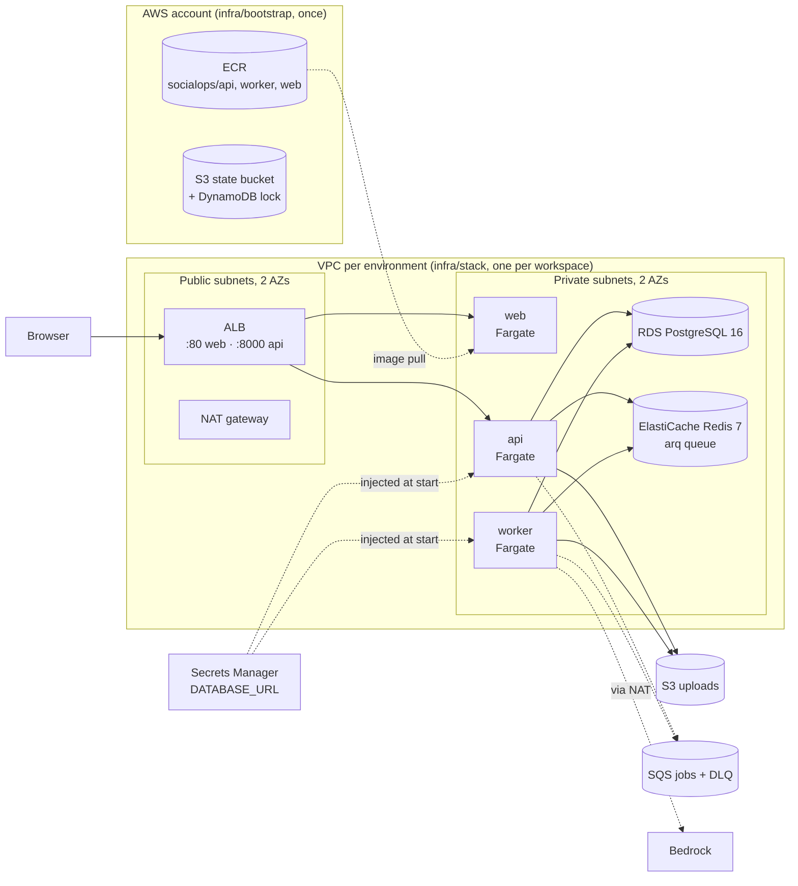

# SocialOps on AWS: Terraform and CI

This folder is Module 3: the whole AWS target architecture as Terraform, two
environments (dev and staging) as workspaces, and a GitHub Actions pipeline
that plans both on every pull request.

**The deliverable is `terraform plan`.** A plan is free and changes nothing.
Applying is optional and costs money; see [What it costs](#what-it-costs).

Everything below can be followed by someone who was not in the room. If a step
surprises you, the reasoning is in
[ADR-0006](../docs/decisions/0006-terraform-layout-and-ci.md).

---

## What gets built



It is the Phase 1 compose stack, re-platformed and not re-architected
([D2](../docs/DECISIONS.md)):

| Compose (Phase 1) | AWS | Module | What changes in the app |
|---|---|---|---|
| `postgres` container | RDS PostgreSQL 16, private, encrypted | `database` | `DATABASE_URL`, now read from Secrets Manager |
| `redis` container | ElastiCache Redis 7 with TLS | `cache` | `REDIS_URL` becomes `rediss://…` |
| `./storage` volume | S3 bucket, versioned, lifecycle rules | `storage` | `STORAGE_BACKEND=s3` (needs `S3Storage`, see [gaps](#known-gaps)) |
| arq on Redis | arq on ElastiCache; SQS + DLQ provisioned for the later swap | `queue` | nothing yet |
| `api`, `worker`, `web` containers | ECS Fargate services, same images | `ecs` | only the dev start commands are overridden |
| ports 3000 / 8000 | one ALB, listeners 80 → web and 8000 → api | `alb` | `NEXT_PUBLIC_API_URL` becomes the ALB address |
| Ollama on the host | Bedrock | `iam` | `LLM_PROVIDER=bedrock` (needs one `case`, see [gaps](#known-gaps)) |
| the compose network | VPC, subnets, NAT, security groups | `network`, `security` | nothing |

## Layout

```
infra/
  bootstrap/          once per AWS account; local state
    main.tf           state bucket, DynamoDB lock table, ECR repositories
    ci.tf             GitHub OIDC provider, ci-plan and ci-ecr-push roles
  stack/              one full environment; one state file per workspace
    backend.tf        S3 backend (bucket passed at init)
    main.tf           composes the modules; the workspace guard
    env/dev.tfvars    everything that differs between environments
    env/staging.tfvars
    tests/            mocked-provider tests, run for each environment
  modules/            network, security, database, cache, storage, queue,
                      iam, alb, ecs, ecr; each with its own tests/
  .tflint.hcl
```

Two roots, because some things exist once per account and some once per
environment. The state bucket cannot live in a state file stored in itself,
and the ECR repositories are shared because one image is promoted through
every environment rather than rebuilt for each.

## Pinned versions

| What | Version | Pinned in |
|---|---|---|
| Terraform | 1.16.4 | `.terraform-version` (tfenv and CI read it); `required_version = "~> 1.16.0"` |
| AWS provider | 6.66.0 exactly | `versions.tf` in both roots; hashes for 5 platforms in `.terraform.lock.hcl` |
| random provider | 3.9.1 exactly | `infra/stack/versions.tf` and its lock file |
| tflint | 0.64.0 | `.github/workflows/terraform.yml` (`TFLINT_VERSION`) |
| tflint AWS ruleset | 0.49.0 | `infra/.tflint.hcl` |
| GitHub Actions | full commit SHAs | both workflow files; the release tag is in a comment |

The modules are local and versioned with the repository, so there are no
registry modules to pin. If you add one, pin it exactly (`version = "5.1.2"`),
not with a range.

To upgrade a provider, change the version in both roots, then:

```bash
terraform -chdir=infra/stack init -upgrade -backend=false
terraform -chdir=infra/stack providers lock \
  -platform=linux_amd64 -platform=linux_arm64 \
  -platform=darwin_amd64 -platform=darwin_arm64 -platform=windows_amd64
# repeat both for infra/bootstrap, run `make tf-check`, commit the lock files
```

The lock files are committed and must record every platform. Otherwise CI,
on Linux, cannot verify a lock file written on a Mac.

---

## Apply order

Steps 0 to 3 produce the deliverable and cost nothing. Step 4 onwards creates
billable resources.

### 0. Tools, and the offline check

```bash
brew install hashicorp/tap/terraform tflint   # versions: see the table above
make tf-check
```

`make tf-check` runs `terraform fmt`, `validate`, `tflint`, and every
`terraform test`, the last against a **mocked** AWS provider. It needs no AWS
account and is exactly what CI runs. If it passes, the configuration is
well-formed and every guardrail in the tests holds for both environments.

### 1. Bootstrap the account (once per AWS account)

Use a sandbox account and credentials that can create IAM roles. Your own
`aws configure` or `aws sso login` profile works.

```bash
cd infra/bootstrap
terraform init
terraform apply              # creates the state bucket, lock table, ECR, CI roles
terraform output -raw github_variables_commands | sh   # connects CI to this account
```

The last line sets four repository variables (`AWS_REGION`, `TF_STATE_BUCKET`,
`AWS_PLAN_ROLE_ARN`, `AWS_ECR_PUSH_ROLE_ARN`). They are not secrets. GitHub
Actions authenticates with OIDC, so no AWS key is stored anywhere.

If the account already has a GitHub OIDC provider, a second one cannot be
created. Apply with `-var create_github_oidc_provider=false` instead.

Bootstrap keeps its own state in `infra/bootstrap/terraform.tfstate`, which is
git-ignored. It is small, and every resource in it can be re-imported, but it
should not live only on one laptop. Move it into the bucket it just made:

```bash
BUCKET=$(terraform output -raw state_bucket)   # read it before the backend changes
cat > backend.tf <<'HCL'
terraform {
  backend "s3" {
    key          = "bootstrap/terraform.tfstate"
    region       = "us-east-1"
    encrypt      = true
    use_lockfile = true
  }
}
HCL
terraform init -migrate-state -backend-config="bucket=$BUCKET"
```

Commit that `backend.tf` so teammates find the state too.

### 2. Point the stack at the state bucket (once per clone)

Everything here is in `us-east-1`. The region is set in three places:
bootstrap's `aws_region`, `infra/stack/backend.tf`, and each `env/*.tfvars`.
Moving region means changing all three.

The bucket is named after the account, so anyone with credentials for it can
derive the name. No need to ask whoever ran bootstrap:

```bash
make tf-init TF_STATE_BUCKET=socialops-tfstate-$(aws sts get-caller-identity --query Account --output text)
```

Terraform prints a deprecation warning for `dynamodb_table`. That is expected:
see [Troubleshooting](#troubleshooting).

### 3. Plan both environments: the deliverable

```bash
make tf-plan ENV=dev
make tf-plan ENV=staging
```

Each command selects that workspace, creating it the first time, and plans
with that environment's tfvars. The two always go together, and the stack
refuses to plan if they do not match (see [The workspace guard](#the-workspace-guard)).

Workspaces must exist before CI can plan, because CI's role cannot write
state. Running these two commands once creates them. From then on, every pull
request gets a plan comment per environment.

### 4. Apply dev (optional, billable)

1. **An image must exist.** Merge to `main` and CI pushes
   `socialops/{api,worker,web}:<full commit SHA>` to ECR. In a pull request,
   set `image_tag` in `env/dev.tfvars` to that SHA.
2. **Narrow `allowed_ingress_cidrs`** in `env/dev.tfvars` to your team's
   addresses. The app has no authentication in Phase 1, and the worker can
   spend money on Bedrock.
3. Apply exactly what you reviewed:

   ```bash
   make tf-plan ENV=dev
   make tf-apply ENV=dev
   ```

4. Create the schema. ECS runs Alembic once, as a one-off task, using the api
   image. This works today, before the gaps below are closed. It is also the
   quickest proof that the private subnets, the security groups and the
   `DATABASE_URL` secret all work together:

   ```bash
   eval "$(terraform -chdir=infra/stack output -raw migrate_command)"
   ```

5. Open it:

   ```bash
   terraform -chdir=infra/stack output web_url
   ```

**Read [Known gaps](#known-gaps) before step 4.** Until `S3Storage` exists,
the api and worker services refuse to start on AWS, because config validation
rejects `STORAGE_BACKEND=s3`. The migrate task is the exception: it never
touches storage and is given `local`. Applying today proves the
infrastructure and the database path, not a running app.

### 5. Promote to staging

Copy the `image_tag` that dev is running into `env/staging.tfvars` in a pull
request. The plan comment shows exactly what changes. Then
`make tf-plan ENV=staging && make tf-apply ENV=staging`.

Nothing is rebuilt. Staging runs the same image bytes that ran in dev,
because ECR tags are immutable.

### 6. Tear down

```bash
# dev: disposable, destroys cleanly
terraform -chdir=infra/stack workspace select dev
terraform -chdir=infra/stack destroy -var-file=env/dev.tfvars
```

Staging has deletion protection on RDS and the ALB. To remove it on purpose,
set `disposable = true` in `env/staging.tfvars`, apply, then destroy the same
way. A protected database takes a final snapshot on destroy, named
`socialops-staging-final-<random>` so a second teardown does not collide with
the first.

Bootstrap is protected twice: `prevent_destroy` on the state bucket and lock
table, and deletion protection on the table. Destroy it last, only after every
workspace is empty, and only by removing those guards in a reviewed commit.

---

## How the environments differ

Everything that differs lives in `env/<name>.tfvars`. Nothing in `main.tf`
names an environment.

| Setting | dev | staging |
|---|---|---|
| `disposable` (no final snapshot, bucket emptied on destroy, no deletion protection on RDS or the ALB) | `true` | `false` |
| VPC | `10.10.0.0/16` | `10.20.0.0/16` |
| NAT gateways | 1 shared | 1 per AZ |
| RDS | `db.t4g.micro`, single-AZ, 1-day backups | `db.t4g.small`, Multi-AZ, 7-day backups |
| Redis | 1 × `cache.t4g.micro` | 2 × `cache.t4g.small`, automatic failover |
| Tasks per service | 1 | 2 |
| Log retention | 7 days | 30 days, plus Container Insights |

## The workspace guard

State is stored per workspace (`env/dev/…`, `env/staging/…`). Planning
`env/staging.tfvars` while the `dev` workspace is selected would therefore
propose turning dev into staging. The stack stops before reading anything:

```
Error: Resource precondition failed
  Workspace "dev" does not match environment "staging". Run: terraform
  workspace select staging   (or pass the matching env/<workspace>.tfvars)
```

`make tf-plan ENV=…` always passes the matching pair. The `default` workspace
is refused as well, because no environment is called `default`.

---

## CI

| Workflow / job | When | Needs AWS | What it does |
|---|---|---|---|
| CI / Lint and test | every PR, every push to main | no | compose up, then `make lint` and `make test` |
| CI / Image (api, worker, web) | after lint and test pass | on main only | builds all three; on main, pushes to ECR tagged with the commit SHA |
| Terraform / fmt, validate, tflint, test | every PR, every push to main | no | `scripts/tf-check.sh`, same as `make tf-check` |
| Terraform / Plan (dev, staging) | every PR from a branch in this repo | yes, read-only | plans each workspace and posts or updates one comment per environment |

Until step 1 is done, the plan jobs pass with a "skipped" notice, and image
builds run but do not push. Nothing fails just because AWS is not set up yet.

Five things worth knowing:

- **Nothing in CI can apply.** The plan role cannot write anything, lock files
  included. It reads infrastructure configuration and state, and is explicitly
  denied application data: S3 objects, DynamoDB items, queued messages and
  logs. The push role can only push to the three repositories, and only from
  `main`.
- **Anyone who can push a branch here can read the database passwords.** A
  pull request can change its own workflow, and a plan has to read Terraform
  state and the `DATABASE_URL` secret, both of which hold the password. Treat
  write access to this repository as access to dev and staging data.
- **Pull requests from forks get no plan.** GitHub gives fork PRs neither an
  OIDC token nor repository variables. Teammates push branches to this
  repository instead.
- **The repository is public, so plan comments are public.** The account ID
  is replaced with `<account-id>` before posting. Resource names and CIDRs are
  still visible.
- **CI plans do not lock.** They run with `-lock=false`, because a pull
  request plan is speculative and never applied. A cancelled run therefore
  cannot leave a stale lock behind. Plans and applies run by people still
  lock.

---

## What it costs

Rough us-east-1 on-demand prices, per month, before free tier. Check the AWS
pricing pages before applying; these are for scale, not a quote.

| | dev | staging |
|---|---|---|
| NAT gateways | ~$33 | ~$66 |
| Fargate (all tasks, 24/7) | ~$63 | ~$144 |
| RDS | ~$14 | ~$51 |
| ElastiCache | ~$12 | ~$47 |
| ALB, public IPv4, Secrets Manager, logs | ~$30 | ~$35 |
| **Total** | **~$150 (~$5/day)** | **~$345 (~$12/day)** |

Bedrock is billed per token on top. `terraform plan`, `make tf-check` and CI
cost nothing. Bootstrap costs cents: S3, on-demand DynamoDB, and ECR storage.
Destroy an applied environment when you are done with it.

ECR keeps every tagged build, because it cannot know which SHA an
environment's tfvars pins, and expiring the one staging runs would break its
next deploy or rollback. Storage is about $0.10 per GB-month. Delete old tags
by hand once no `env/*.tfvars` references them. Untagged layers expire on
their own after seven days.

## Known gaps

These are left for later modules on purpose. Each needs app code, not
infrastructure.

- **`S3Storage` does not exist yet.** The api and worker task definitions set
  `STORAGE_BACKEND=s3`, and `config.py` accepts only `local`, so both fail at
  start, loudly and on purpose. It needs one `StorageBackend` subclass (D25).
  The migrate task is given `local` and runs today.
- **`LLM_PROVIDER=bedrock` raises `NotImplementedError`** in
  `worker/llm.py::_build_model`. It needs one `case`, as the README's
  *Switching LLM provider* section describes.
- **arq is still the queue.** SQS and its DLQ exist, the worker role can use
  them, and `SQS_QUEUE_URL` is already in the task environment, but nothing
  reads it.
- **The web image builds at container start.** `next build` bakes
  `NEXT_PUBLIC_API_URL` into the browser bundle, and building per environment
  would break "one image, promoted". The fix is a production Dockerfile stage
  plus a runtime config endpoint. Until then, first boot takes about two
  minutes.
- **HTTP only.** HTTPS needs a domain and an ACM certificate. Route 53 and WAF
  come in Phase 5.
- **No autoscaling or alarms.** Those belong to the observability module, and
  `/health/ready` belongs on an alarm there. See the note in `modules/alb`.
- **The database password is in Terraform state.** The state bucket is
  encrypted and private. Write-only arguments (`password_wo`) are the upgrade
  path.
- **Stretch goal not built:** an EKS or kind deployment path sharing these
  images.

## Troubleshooting

| You see | It means |
|---|---|
| `Warning: Deprecated Parameter … dynamodb_table` | Expected. The brief asks for a DynamoDB lock table; Terraform 1.16 prefers `use_lockfile`, and both are on. |
| `Workspace "x" does not match environment "y"` | The workspace guard. Use `make tf-plan ENV=y`. |
| `Error acquiring the state lock` | Someone else is applying, or a local run was killed mid-plan. Wait, or add `-lock-timeout=5m`. For a lock you know is stale: `terraform -chdir=infra/stack force-unlock <ID>`. CI plans never lock. |
| `RepositoryNotFoundException` for `socialops/api` during plan | Bootstrap has not been applied in this account (step 1). |
| Apply succeeds, then tasks stop with `CannotPullContainerError` | `image_tag` names a commit CI never pushed. ECS does not check the tag when registering a task definition. Only merges to `main` are pushed. |
| Plan job says "skipped" | The repository variables from step 1 are not set. |
| Plan job: `Workspace dev does not exist` | Run step 3 once with your own credentials. |
